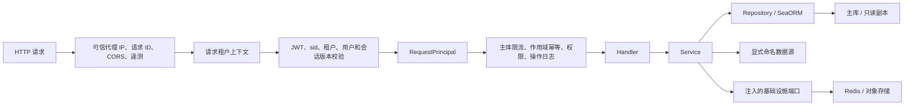

# RyFrame 后端架构与演进指南

> 最后核对：2026-07-18
> 适用范围：后端仓库 `ryframe` 与独立前端仓库 `ryframe-vue3`

本文档只描述当前代码事实和已经确认的演进方向。接口细节以运行时 OpenAPI 文档为准，不在 Markdown 中维护第二份完整契约。

## 1. 仓库与交付边界

RyFrame 采用前后端独立 Git 和独立 CI，但稳定版使用同一版本号、同一 Git tag 和同一发布窗口：

| 仓库 | 职责 | 主要产物 |
| --- | --- | --- |
| `ryframe` | Rust 服务、数据库迁移、OpenAPI、部署配置和联合发布门禁 | RC/stable 标签、项目级源码 Release 与 Nightly 源码快照 |
| `ryframe-vue3` | Vue 3 管理端 | 同名 RC/stable 标签与 Nightly 源码快照 |

本地开发工作区固定将独立前端仓库检出到后端的 `ryframe-vue3/` 目录，后端通过 `/ryframe-vue3/` 忽略该嵌套仓库：

```text
ryframe/
├── crates/
└── ryframe-vue3/  # 独立 .git
```

两个仓库只通过 `/api/v1` HTTP 契约协作。后端契约入口为：

```text
GET /api/v1/api-docs/openapi.json
```

## 2. 当前后端结构

### 2.1 Workspace 职责

| Crate | 当前职责 |
| --- | --- |
| `ryframe` | 唯一可执行入口、配置加载、迁移、依赖装配和服务启动 |
| `ryframe-api` | Router、Handler、传输 DTO、OpenAPI 和 HTTP 组合策略 |
| `ryframe-service` | 应用用例、业务规则、输出模型和 Repository 编排 |
| `ryframe-db` | SeaORM Entity、Repository、数据范围查询、主库/副本和命名业务数据源拓扑 |
| `ryframe-db-migration` | 可重复执行的数据库迁移 |
| `ryframe-auth` | JWT、密码、认证中间件、`RequestPrincipal` 和主体解析端口 |
| `ryframe-middleware` | CORS、限流、请求 ID、遥测等横切 HTTP 能力 |
| `ryframe-monitor` | 健康、指标、缓存、数据库监控端口和运行时状态 |
| `ryframe-generator` | Entity、Repository、Service、Handler、DTO 代码生成 |
| `ryframe-storage` | `ObjectStorage` 端口、本地/RustFS/MinIO/S3 后端、路径校验和 SigV4 签名 |
| `ryframe-config` | 类型化配置、环境变量覆盖和敏感配置解密 |
| `ryframe-core` | 分页、Repository 基础、缓存、Redis、租户一致性校验、数据库监控端口、锁和熔断 |
| `ryframe-common` | 错误、响应、常量、i18n 和通用工具 |
| `ryframe-macro` | 路由、权限、Repository 等过程宏 |

当前没有为尚未闭环的能力保留空壳。未消费的事件总线、消息队列、任务队列、gRPC、硬编码功能开关和 task-local 动态切库已经删除。数据库拓扑明确区分同结构只读副本与命名业务数据源；业务数据源只有存在具体消费者、配置、监控和测试时才能加入。

### 2.2 启动与组合根

`crates/ryframe` 是唯一组合根，启动顺序为：

1. 加载配置，解密敏感字段，再严格校验环境、密钥、数据库和依赖模式；运行中不重新加载配置。
2. 初始化日志和遥测。
3. 连接主库、全部只读副本和命名业务数据源，在主库执行迁移，并只校验主库与同结构副本的系统表结构。
4. 初始化 Redis、refresh family、撤销状态、限流器、对象存储和熔断器；生产 Redis 为 required，任何不可用都会阻止启动或令 readiness 失败，对象存储必须完成连接、凭据以及 `uploads`/`avatar` bucket 检查。
5. 在 `boot/services.rs` 构造 Service。
6. 在 `boot/app_state.rs` 聚合运行时依赖。
7. 组装 `/api/v1` 路由、中间件和优雅停机。

具体数据库、Redis 和对象存储实现只能在组合根选择。Handler 或 Service 不得读取环境变量并自行创建基础设施连接。

### 2.3 请求链路



受保护请求只构造一次不可变 `RequestPrincipal`。权限守卫和 Handler 复用该主体，不重复查询角色、权限和数据范围。

### 2.4 数据边界

- 应用配置一个唯一写主库 `[database.primary]`，以及零到多个命名只读副本 `[[database.replicas]]`。
- `[[database.sources]]` 表达按名称显式访问的业务数据库；本机 `ryframe_device` 由代码生成器消费，不参与系统查询路由。
- 主库、副本和命名业务数据源全部使用 MySQL；业务数据源可以有独立结构，但不参与系统查询路由。
- 命令、事务、认证授权、配额/唯一性校验和其他一致性敏感读取固定使用主库；普通查询从副本轮询，未配置副本时回退主库。
- 已配置副本连接或结构校验失败会阻止启动，不会静默缩减拓扑；运行时状态会报告每个节点，查询失败也不会隐式转发主库。
- 已配置业务数据源连接失败同样阻止启动，但应用不会对其执行主库迁移或系统表校验。
- 业务表采用共享表加 `tenant_id` 的隔离方式。
- 认证中间件构造 `RequestPrincipal`，其中唯一的业务主体是不可变 `ActorContext`。
- Service 的租户业务用例显式接收 `&ActorContext`；预认证流程显式接收经过校验的 `tenant_id`。
- Repository 的每个租户查询显式接收 `tenant_id`，不得从 task-local 推断业务租户。
- Tokio task-local 只由 HTTP 中间件建立，并用于校验显式租户与当前请求一致；后台任务可以只传递显式租户。
- 数据库内部 ID 使用 `i64`；HTTP DTO/输出统一使用字符串，避免 JavaScript 64 位整数精度丢失。
- `AppState` 不暴露数据库连接；`ryframe-api` 的生产依赖不包含 `ryframe-db` 或 `sea_orm`。
- Handler 不允许导入数据库实现，操作日志等 HTTP 横切能力通过 Service 写入。
- `ryframe-auth` 和 `ryframe-monitor` 只接收注入端口，不允许依赖 `ryframe-db`、SeaORM 或裸数据库连接。
- `DatabaseCluster` 和对象存储在组合根注入 Service；公开用例方法只接收主体和业务参数。
- `ryframe-storage` 拥有对象存储端口与具体后端；`ryframe-db` 不生成公开 URL，也不依赖存储实现。
- Repository 字段不允许从 Service 公开，事务边界由 Service 用例拥有。

## 3. 已完成的架构收敛

1. 删除重复的用户上下文中间件，认证主体统一为 `RequestPrincipal`。
2. Service 的 Repository 字段已私有化，Handler 不再直接查询 Repository。
3. `AppState` 已移入独立 `state` 模块，运行时能力集中装配。
4. 数据库配置已收敛为显式主库/只读副本/命名业务数据源拓扑；自动路由只作用于副本，业务数据源必须由用例按名称选择。
5. 删除没有订阅者或消费者的事件、消息、任务、gRPC 和功能开关空壳。
6. API 路径统一为复数资源；分页列表使用资源根路径，不分页列表使用 `/all`。
7. 删除旧路径别名，不保留 `listNoPage`、`changeStatus`、`configKey` 等旧写法。
8. 每个实际 Handler 都有 `utoipa` 注解并进入 OpenAPI；`operationId` 由方法和路径稳定生成。
9. DTO 默认拒绝未知字段，输入执行校验，生成器模板遵守相同边界。
10. CI 已加入源码卫生、架构边界、格式、Clippy、测试、覆盖率和前端严格检查。
11. 数据库集群已在组合根注入 Service，公开/内部用例方法不再逐次接收连接，由用例通过 `read()`/`write()`表达一致性意图。
12. 文件服务同时持有数据库与对象存储，HTTP 状态不再暴露对象存储实现。
13. 没有 trait 的 16 个 `*ServiceImpl` 已统一改名为 `*Service`，类型名不再暗示不存在的多实现体系。
14. 代码生成器仅从 MySQL `information_schema` 读取元数据，数据库后端不再是运行时分支。
15. 分页契约只接受 `page` 和 `page_size`，旧 camelCase 参数会明确失败；未使用的分页提取器已删除。
16. 用户、登录日志、操作日志和文件上传改为命名 Command/Query，生产 Rust 源码不再使用 `allow` 压制 lint。
17. 监控 OpenAPI 注解已移动到真实 Handler，删除文档专用空函数；限流器实现策略保持私有。
18. 配置列表的 `name`/`key` 筛选已贯穿 HTTP、Service 和 Repository；查询 DTO 不再依赖静默忽略未知字段。
19. `AppState` 已移除原始数据库连接，认证和监控只接收各自窄状态；操作日志中间件改为注入 `OperLogService`，API 生产代码不再依赖数据库实现。
20. API 与过程宏示例已全部改为可编译 doctest；源码门禁禁止 ignored doctest，普通测试只允许精确列出的外部 RustFS/S3 集成项被忽略。
21. 租户和操作者已统一为显式 `ActorContext`；Repository 接收显式 `tenant_id`，task-local 只保留请求内一致性校验。
22. 代码生成器已同步生成 `RequestPrincipal -> ActorContext -> tenant_id` 调用链，并通过模板语法、架构边界和 Golden Hash 契约测试。
23. 在线会话、强制退出和黑名单键已按租户隔离；密码重置前后端统一要求显式租户，操作日志递归脱敏凭据字段且验证码不再写日志。
24. 租户初始化事务已移入 `TenantProvisioningRepository`，`TenantService` 只保留平台授权和生命周期规则，并补齐跨租户、状态、密码与会话版本测试。
25. 用户 Service 已按命令、查询、角色和密码重置拆分，密码与 `auth_version` 原子更新；用户 Handler 和前端用户页也已按 CRUD、导入导出、部门树和页面编排拆分。
26. 缓存模块已按后端、权限键、保护策略、击穿保护和预热拆分；本地缓存执行容量淘汰和过期清理，保护层使用统一的类型化缓存条目。
27. 对象存储已从 `ryframe-common` 移入独立 `ryframe-storage`；RustFS 是一等配置后端并复用 S3 兼容适配器，本地路径执行目录穿越与符号链接校验，SigV4 使用配置 region，默认不修改 bucket 公开策略。
28. 文件 URL 由 `FileService` 选择，Repository 只持久化元数据；元数据写入失败时会补偿删除已上传对象。
29. 验证码已按挑战生成、字形和图像渲染拆分；算术符号、UTF-8 布局和非法尺寸均有回归测试，公开 API 只暴露完整验证码生成入口。
30. 角色权限和数据范围改为 `/{id}/permissions`、`/{id}/data-scope` 子资源；数据范围字段与部门关系在同一事务中替换并覆盖回滚场景。
31. 用户资料、角色和状态写入职责已分离为资源根、`/{id}/roles` 和 `/{id}/status`；创建用户可在同一事务内写入角色，Repository 的角色整体替换也统一为原子操作。
32. 权限类型改为后端枚举和前端联合类型；角色、菜单、权限和用户页面已拆出领域 composable、表单对话框与纯转换函数，确认取消不再吞掉真实请求错误。
33. `ryframe-auth` 通过 `PrincipalResolver` 委托 `AuthService` 解析租户、用户、角色、权限和数据范围；`ryframe-monitor` 通过 `DatabaseMonitor` 使用 `ryframe-db` 的 SeaORM 适配器。两个横切 crate 已移除 `ryframe-db`、SeaORM 和裸数据库连接依赖，并由架构门禁防止回流。
34. `AuthService` 已拆为会话签发、身份与授权装载、主体解析和暴力破解防护模块；登录、刷新、当前用户和请求主体共享身份/授权规则。请求授权每次从 MySQL 解析，不使用 Redis 权限缓存，避免缓存删除失败形成旧权限窗口。
35. 路由权限目录由 `ryframe-api/build.rs` 在编译期使用 `syn` 解析并嵌入二进制，覆盖 API 与监控路由；权限 Service 只同步显式传入的目录，不再依赖源码路径或部署环境中的 Rust 文件。
36. Redis 模式匹配统一使用游标 `SCAN` 和批量删除，不暴露阻塞式 `KEYS`；一次性数据通过 Lua 原子取删，缓存写失败必须记录上下文。
37. 菜单按模型与层级校验拆分并使用 `MenuType` 强类型，`route_key` 规范化后再校验和持久化；部门按 command/query/model 拆分，部门引用关系由 Repository 查询。
38. 部门、菜单和配置缓存失效均在用例返回前等待完成；Handler 不直接访问 Redis，缓存故障保持可观测且不通过后台任务制造短暂脏读。
39. OpenAPI 可由 `export_openapi` 确定性导出到 `openapi/openapi.json`；119 个操作全部包含成功响应 schema，写操作和 34 个查询操作具备请求契约，CI 校验快照并上传独立产物。
40. 稳定响应模型和 multipart 表单已进入组件 schema，JSON 中的 Snowflake ID 统一为字符串；前端同步快照并通过 `openapi-typescript` 生成只读类型，API 模块不再复制 DTO 字段。
41. 列表查询宏同时生成分页 `ListQuery` 与纯筛选 `FilterQuery`；`/all` 和 `/export` 不再声明或忽略分页参数，OpenAPI 注解类型必须与 Handler 的 `Query` 提取类型一致。
42. 菜单分页已下沉到 Repository，代码生成器的元数据筛选与分页已移入 Service；架构门禁禁止 Handler 对内存集合执行 `skip/take` 分页。
43. OpenAPI 通过 `x-ryframe-menu-routes` 导出默认菜单的稳定 `route_key` 与 `M/C` 类型；后端 CI 校验 SQL 种子和历史回填迁移，前端 CI 校验页面注册表的精确集合与组件类型。
44. 新密码规则集中在 `ryframe-auth::password`，个人修改、重置完成和租户管理员创建共用同一校验；OpenAPI 通过 `x-ryframe-password-policy` 发布规则，前端生成运行时验证配置而不再复制正则。
45. 个人修改密码与密码重置都会原子递增 `auth_version`，旧 access/refresh token 随即失效；弱密码校验发生在写事务前，不会消耗重置请求或创建半成品租户。
46. CI 在 MySQL 8.4、Redis 7 与固定版本 RustFS 容器上重置真实数据库、启动服务并执行 API 冒烟脚本；旧路径、缺失租户头、OpenAPI 扩展缺失和运行日志 warning/error 都会使 job 失败。
47. CI 在 MySQL 8.4 中为测试上下文创建隔离数据库，强制执行副本轮询、主库写入、命名数据源、迁移和代码生成器测试；运行时冒烟同时验证 Redis 与 RustFS。
48. 配置收敛为静态启动配置，环境名统一为 `dev/test/prod`；敏感字段先解密再校验，生产默认密钥、缺失配置和未知字段都会拒绝启动。
49. refresh token 只存在于 API 域 HttpOnly Cookie，access token 和 CSRF challenge 只存在于页面内存；Redis 以 `sid` 维护绝对 7 天的 refresh family，并通过 Lua CAS 轮换和检测重放。
50. 根路径 `/livez` 只检查进程，`/readyz` 检查 MySQL、required Redis 和必要对象存储；探针绕过租户、认证、幂等和业务限流。
51. 幂等只应用于认证后的 system/platform 写请求，键绑定租户、用户、方法、规范路径和 body；限流使用可信代理解析后的 IP，并对拒绝响应提供 `Retry-After`。
52. 稳定发布验证标签位于 `main`、前后端同标签同版本，并要求同一 RC commit 的 GitHub Deployment 提供连续至少 48 小时的可审计观察记录，再经过启用防止自审的 `stable-release` required-reviewer 审批；管理员绕过必须在仓库设置中关闭并由审计日志复核。后端 RC/stable 与前后端 Nightly Release 只保留 GitHub 自动生成的 zip 与 tar.gz 源码快照，不发布自定义归档、镜像、SBOM、校验和或证明附件；Nightly 仅在对应仓库的 `main` CI 成功后更新，前端同名 RC/stable 标签不在联合门禁前独立发布。

## 4. 后续优先级

### P1：补齐关键业务用例测试

全 workspace 最近一次完整统计行覆盖率为 69.06%，已经通过 55% 门禁，但总数仍会掩盖关键模块的盲区。租户 Service、数据库拓扑、对象存储和 `file_service` 的正常路径与元数据失败补偿已经有独立测试；下一阶段优先覆盖认证失败、权限拒绝、导入导出和验证码失败分支。外部系统通过可注入端口或本地测试实现隔离，真实拓扑与 RustFS 链路由运行时 CI 验证。

覆盖率提升应以关键分支和失败路径为目标，不通过测试纯数据结构或抬高阈值来制造数字。

### P2：控制剩余复杂度热点

- `ryframe-config/src/app_config.rs` 仍集中较多配置组合与校验；新增配置域时应按领域拆分类型和验证，不继续扩大单文件。
- 在线用户 Service 同时包含 Redis/内存实现、会话生命周期和查询映射；新增会话策略前应先按后端与用例拆分，避免继续扩大单文件。
- `ryframe-core` 继续只保留被生产链路使用的稳定能力；新增平台抽象必须同时有生产者、消费者、配置、监控和测试。

## 5. 二次开发书写规范

### 5.1 新增后端资源

1. 在 `ryframe-db` 添加 Entity、Repository 和迁移。
2. 在 `ryframe-service` 添加 Command/Query、业务校验和输出模型。
3. 在 `ryframe-api/dto` 添加传输 DTO，使用 `deny_unknown_fields`、`Validate` 和 `ToSchema`。
4. Handler 只完成 Path/Query/JSON 提取、DTO 到 Command 映射和响应映射。
5. 使用 `#[get]`、`#[post]`、`#[put]`、`#[delete]` 和 `route!`，不直接调用 Axum `.route()`；`#[perm(...)]` 会在编译期自动进入权限目录。
6. 将 Handler 注册到 `openapi.rs`，架构检查会阻止漏注册。
7. 为 Repository、Service 和路由契约添加对应测试。

Service 在组合根构造并持有基础设施依赖。Handler 的目标调用形式是：

```rust
state
    .services
    .example
    .find_by_page(&current_user, ExampleListParams { page, name, status })
    .await
```

不要在方法参数中重新引入 `DatabaseConnection`、对象存储或 Redis 客户端；需要新适配器时在 `boot/services.rs` 统一注入。

### 5.2 路由约定

| 操作 | 路径 |
| --- | --- |
| 分页列表 | `GET /api/v1/system/resources` |
| 全量列表 | `GET /api/v1/system/resources/all` |
| 详情 | `GET /api/v1/system/resources/{id}` |
| 创建 | `POST /api/v1/system/resources` |
| 更新 | `PUT /api/v1/system/resources/{id}` |
| 删除 | `DELETE /api/v1/system/resources/{id}` |
| 子资源整体替换 | `PUT /api/v1/system/resources/{id}/children` |
| 有限状态更新 | `PUT /api/v1/system/resources/{id}/status` |

不得增加旧接口别名。需要破坏性变更时直接更新 OpenAPI、前端调用、测试和 CHANGELOG。

### 5.3 类型和错误

- 内部 ID 使用强类型或 `i64`，传输层统一字符串。
- 不用 `String` 表示有限状态；优先使用可序列化枚举。
- 不用多个 `Option<T>` 模拟互斥输入；使用枚举或经过验证的 Command。
- Service 返回 `AppResult<Output>`，不返回 Axum Response。
- 预期业务失败使用明确的 `AppError`，不得用 `unwrap` 或静默吞错。

## 6. CI 架构门禁

后端必须通过：

```bash
python scripts/check_source_hygiene.py
python scripts/check_architecture.py
python scripts/check_permission_routes.py
cargo fmt --all -- --check
cargo check --workspace --all-targets
cargo clippy --workspace --all-targets -- -D warnings
cargo test --workspace
```

前端必须通过：

```bash
cd ryframe-vue3
pnpm check
```

前端虽保留独立 Git 历史，但本地工作区固定为 `ryframe-vue3/`。所有 `pnpm` 命令必须以该目录为工作目录；后端根目录出现 `.pnpm-store` 会被源码门禁判定为错误。

门禁当前锁定：UTF-8/乱码、非外部依赖的忽略测试、ignored doctest、legacy API 字段、Rust lint `allow`、MySQL-only 依赖、静态配置、Handler 数据库/Redis 访问和内存分页、认证和监控数据库实现依赖、权限目录运行时源码扫描、阻塞式 Redis `KEYS`、非原子一次性读取、分离式缓存失效、公开 Service 数据库参数、Service 反向依赖和公开 Repository、主库/副本配置与读写路由、RustFS 启动及 CI 冒烟覆盖、路由宏、兼容别名、OpenAPI 注册完整性、Query DTO 与提取器一致性、全量操作禁止分页参数、规范快照导出、请求/响应 schema、Cookie/CSRF 会话契约、默认 `route_key` 集合、统一密码策略以及前端 bundle/覆盖率预算。每完成一个架构阶段，应把新边界加入脚本，避免回退。

## 7. 完成标准

后端分层改造完成需要同时满足：

- Handler 不导入数据库，也不传递数据库连接。
- Service 接收业务 Command/Query 和显式主体，不接收 HTTP 类型。
- Repository 不向 API 暴露 SeaORM Model。
- 数据库写入和一致性读取只走主库，普通查询只通过集群读取策略选择节点。
- 租户、操作者、权限和数据范围来源唯一且可测试。
- OpenAPI 是前后端唯一契约来源，并有兼容性门禁。
- 前后端可以独立构建和测试，但稳定版必须通过同标签、同版本和同契约的联合发布门禁，CI 全程零警告。
- 新增一个标准 CRUD 模块不需要复制基础设施装配、旧路径或重复类型定义。
