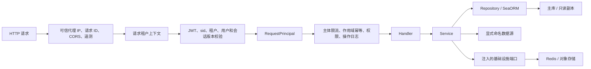

# RyFrame 后端架构与演进指南

> 最后核对：2026-08-03
> 适用范围：后端仓库 `ryframe` 与独立前端仓库 `ryframe-vue3`

本文档只描述当前代码事实和已经确认的演进方向。接口细节以运行时 OpenAPI 文档为准，不在 Markdown 中维护第二份完整契约。

## 1. 仓库与交付边界

RyFrame 采用前后端独立 Git 和独立 CI，但稳定版使用同一版本号、同一 Git tag 和同一发布窗口：

| 仓库 | 职责 | 主要产物 |
| --- | --- | --- |
| `ryframe` | Rust 服务、数据库迁移、OpenAPI、部署配置和联合发布门禁 | 稳定版标签与 GitHub 源码快照 |
| `ryframe-vue3` | Vue 3 管理端 | 由后端联合发布主控校验的同名稳定版标签 |

本地开发工作区固定将独立前端仓库检出到后端的 `ryframe-vue3/` 目录，后端通过 `/ryframe-vue3/` 忽略该嵌套仓库：

```text
ryframe/
├── crates/
└── ryframe-vue3/  # 独立 .git
```

两个仓库只通过 `/api/v1` HTTP 契约协作。后端契约入口为：

```text
GET /api/v1/api-docs/openapi.json
```

## 2. 当前后端结构

### 2.1 Workspace 职责

| Crate | 当前职责 |
| --- | --- |
| `ryframe` | API、`ryframe-worker`、`ryframe-migrate` 可执行入口，负责配置加载、依赖装配和服务启动 |
| `ryframe-api` | Router、Handler、传输 DTO、OpenAPI、请求语言与消息 WebSocket 组合策略 |
| `ryframe-service` | 应用用例、业务规则、输出模型和 Repository 编排 |
| `ryframe-db` | SeaORM Entity、Repository、数据范围查询、主库/副本和命名业务数据源拓扑 |
| `ryframe-db-migration` | 可重复执行的数据库迁移 |
| `ryframe-auth` | JWT、密码、认证中间件、`RequestPrincipal` 和主体解析端口 |
| `ryframe-middleware` | CORS、限流、请求 ID、遥测等横切 HTTP 能力 |
| `ryframe-monitor` | 健康、指标、缓存、数据库监控端口和运行时状态 |
| `ryframe-generator` | Entity、Repository、Service、Handler、DTO 代码生成 |
| `ryframe-storage` | `ObjectStorage` 端口、本地/RustFS/MinIO/S3 后端、路径校验和 SigV4 签名 |
| `ryframe-config` | 类型化配置、环境变量覆盖和生产 secret 来源校验 |
| `ryframe-core` | 分页、Repository 基础、缓存、Redis、租户一致性校验、数据库监控端口、锁和熔断 |
| `ryframe-kernel` | 传输无关的主体、数据范围、错误、错误码、常量和枚举 |
| `ryframe-http` | HTTP 错误映射、统一响应信封和 Axum 响应适配 |
| `ryframe-i18n` | 显式注入的语言协商、资源一致性校验与本地化文本渲染 |
| `ryframe-utils` | 雪花 ID、脱敏、数据差异、客户端信息与文件处理等通用工具 |
| `ryframe-captcha` | 验证码题目生成与图像渲染 |
| `ryframe-excel` | Excel 导入导出 |
| `ryframe-macro` | 路由、权限、Repository 等过程宏 |

当前没有为尚未闭环的能力保留空壳。未消费的事件总线、消息队列、任务队列、gRPC、硬编码功能开关和 task-local 动态切库已经删除。数据库拓扑明确区分同结构只读副本与命名业务数据源；业务数据源只有存在具体消费者、配置、监控和测试时才能加入。

### 2.2 启动与组合根

`crates/ryframe` 是唯一组合根，启动顺序为：

1. 加载配置，应用环境变量覆盖，再严格校验环境、secret 来源、数据库和依赖模式；运行中不重新加载配置。
2. 初始化日志和遥测。
3. 连接主库、全部只读副本和命名业务数据源，在主库执行迁移，并只校验主库与同结构副本的系统表结构。
4. 初始化 Redis、refresh family、撤销状态、限流器、对象存储和熔断器；生产 Redis 为 required，任何不可用都会阻止启动或令 readiness 失败，对象存储必须完成连接、凭据以及 `uploads`/`avatar` bucket 检查。
5. 在 `boot/services.rs` 构造 Service。
6. 在 `boot/app_state.rs` 聚合运行时依赖。
7. 组装 `/api/v1` 路由和中间件，启动后台就绪探测，并在优雅停机时停止探测与其他后台任务。

API 与独立 Worker 共用唯一日志初始化实现。`stdout` 不创建本地日志目录，是生产配置和
容器编排的默认值；显式选择 `file` 时才创建 `logs/`，按 UTC 日期每天滚动，并把文件总数
限制在 `logger.retention_days`。日志级别、格式、输出目标和 1–3650 天的保留数量均在启动
前完成强类型解析与校验。

SQL 事件也经过同一 writer：`off` 不生成 SQL 日志，`slow` 仅记录达到阈值的语句，
`summary` 输出摘要，`full` 才输出完整参数化 SQL。原始 SQL 不进入 OpenTelemetry 数据库
span，任何模式都不记录绑定参数值；数据库日志继承 HTTP、后台任务或 Outbox 的关联上下文。

具体数据库、Redis 和对象存储实现只能在组合根选择。Handler 或 Service 不得读取环境变量并自行创建基础设施连接。

### 2.3 请求链路


```mermaid
flowchart LR
    A["HTTP 请求"] --> B["可信代理 IP、请求 ID、CORS、遥测"]
    B --> C["请求租户上下文"]
    C --> D["JWT、sid、租户、用户和会话版本校验"]
    D --> E["RequestPrincipal"]
    E --> F["主体限流、作用域幂等、权限、操作日志"]
    F --> G["Handler"]
    G --> H["Service"]
    H --> I["Repository / SeaORM"]
    I --> J["主库 / 只读副本"]
    H --> M["显式命名数据源"]
    H --> K["注入的基础设施端口"]
    K --> L["Redis / 对象存储"]
```

受保护请求只构造一次不可变 `RequestPrincipal`。权限守卫和 Handler 复用该主体，不重复查询角色、权限和数据范围。

### 2.4 数据边界

- 应用配置一个唯一写主库 `[database.primary]`，以及零到多个命名只读副本 `[[database.replicas]]`。
- `[[database.sources]]` 表达按名称显式访问的业务数据库；本机 `ryframe_device` 由代码生成器消费，不参与系统查询路由。
- 主库、副本和命名业务数据源全部使用 MySQL；业务数据源可以有独立结构，但不参与系统查询路由。
- 命令和事务使用 `write()` 固定进入主库；所有查询必须调用 `select_read(ReadConsistency)` 显式选择一致性。写后读、认证授权、数据权限、安全决策、配额与唯一性校验选择 `Strong`，普通只读列表和详情选择 `Eventual`，未配置健康副本时才回退主库。
- 已配置副本始终保留在拓扑中；连接或结构校验失败不会阻止主库启动，但副本在连续两次完整探测成功前不参与路由。监督器每 5 秒以 2 秒超时探测，网络故障连续三次摘除并按 5–60 秒退避重连；结构不一致立即摘除。运行时状态会报告每个节点，查询失败也不会隐式转发主库。
- 已配置业务数据源连接失败同样阻止启动，但应用不会对其执行主库迁移或系统表校验。
- 业务表采用共享表加 `tenant_id` 的隔离方式。
- 认证中间件构造 `RequestPrincipal`，其中唯一的业务主体是不可变 `ActorContext`。
- Service 的租户业务用例显式接收 `&ActorContext`；预认证流程显式接收经过校验的 `tenant_id`。
- `tenant_id` 统一限制为 2–64 位 ASCII 字母、数字、连字符或下划线，且首尾必须为字母或数字；该约束在入口和 Service 边界重复校验，避免 Redis glob/键分隔符注入。
- Repository 的每个租户查询显式接收 `tenant_id`，不得从 task-local 推断业务租户。
- Tokio task-local 只由 HTTP 中间件建立，并用于校验显式租户与当前请求一致；后台任务可以只传递显式租户。
- 数据库内部 ID 使用 `i64`；HTTP DTO/输出统一使用字符串，避免 JavaScript 64 位整数精度丢失。
- `AppState` 不暴露数据库连接；`ryframe-api` 的生产依赖不包含 `ryframe-db` 或 `sea_orm`。
- Handler 不允许导入数据库实现，操作日志等 HTTP 横切能力通过 Service 写入。
- `ryframe-auth` 和 `ryframe-monitor` 只接收注入端口，不允许依赖 `ryframe-db`、SeaORM 或裸数据库连接。
- `DatabaseCluster` 和对象存储在组合根注入 Service；公开用例方法只接收主体和业务参数。
- `ryframe-storage` 拥有对象存储端口与具体后端；`ryframe-db` 不生成公开 URL，也不依赖存储实现。
- Repository 字段不允许从 Service 公开，事务边界由 Service 用例拥有。

## 3. 已完成的架构收敛

1. 删除重复的用户上下文中间件，认证主体统一为 `RequestPrincipal`。
2. Service 的 Repository 字段已私有化，Handler 不再直接查询 Repository。
3. `AppState` 已移入独立 `state` 模块，运行时能力集中装配。
4. 数据库配置已收敛为显式主库/只读副本/命名业务数据源拓扑；自动路由只作用于副本，业务数据源必须由用例按名称选择。
5. 删除没有订阅者或消费者的事件、消息、任务、gRPC 和功能开关空壳。
6. API 路径统一为复数资源；表格列表使用资源根分页，选择器使用有上限的 `/options` 候选接口。
7. 删除旧路径别名和无限量列表，不保留旧调用写法。
8. 每个实际 Handler 都有 `utoipa` 注解并进入 OpenAPI；`operationId` 由方法和路径稳定生成。
9. DTO 默认拒绝未知字段，输入执行校验，生成器模板遵守相同边界。
10. 后端托管 CI 已加入格式、生产库与可执行文件 Clippy、工作流、预发布依赖、权限绑定、OpenAPI/MySQL 快照一致性和依赖安全审计；测试、基准和验收资产仅在本地忽略目录中维护，前端严格检查由独立前端仓库的 CI 负责。
11. 数据库集群已在组合根注入 Service，公开/内部用例方法不再逐次接收连接；命令使用 `write()`，查询只能通过 `select_read(ReadConsistency)` 显式表达强一致或最终一致意图，旧读取辅助入口已删除。
12. 文件服务同时持有数据库与对象存储，HTTP 状态不再暴露对象存储实现。
13. 没有 trait 的 16 个 `*ServiceImpl` 已统一改名为 `*Service`，类型名不再暗示不存在的多实现体系。
14. 代码生成器仅从 MySQL `information_schema` 读取元数据，数据库后端不再是运行时分支。
15. 分页契约只接受 `page` 和 `page_size`，旧 camelCase 参数会明确失败；未使用的分页提取器已删除。
16. 用户、登录日志、操作日志和文件上传改为命名 Command/Query，生产 Rust 源码不再使用 `allow` 压制 lint。
17. 监控 OpenAPI 注解已移动到真实 Handler，删除文档专用空函数；限流器实现策略保持私有。
18. 配置列表的 `name`/`key` 筛选已贯穿 HTTP、Service 和 Repository；查询 DTO 不再依赖静默忽略未知字段。
19. `AppState` 已移除原始数据库连接，认证和监控只接收各自窄状态；操作日志中间件改为注入 `OperLogService`，API 生产代码不再依赖数据库实现。
20. API 与过程宏文档示例保持为可直接复制的代码片段；测试、doctest 与外部 RustFS/S3 验收资产只允许存在于本地忽略目录，不进入托管 CI。
21. 租户和操作者已统一为显式 `ActorContext`；Repository 接收显式 `tenant_id`，task-local 只保留请求内一致性校验。
22. 代码生成器已同步生成 `RequestPrincipal -> ActorContext -> tenant_id` 调用链，并在本地验收中校验模板语法与生成结果。
23. 在线会话、强制退出和黑名单键已按租户隔离；密码重置前后端统一要求显式租户，操作日志递归脱敏凭据字段且验证码不再写日志。
24. 租户初始化事务已移入 `TenantProvisioningRepository`，`TenantService` 只保留平台授权和生命周期规则，并补齐跨租户、状态、密码与会话版本测试。
25. 用户 Service 已按命令、查询、角色和密码重置拆分，密码与 `authorization_version` 原子更新；用户 Handler 和前端用户页也已按 CRUD、导入导出、部门树和页面编排拆分。
26. 缓存模块已按后端、权限键、保护策略、击穿保护和预热拆分；本地缓存执行容量淘汰和过期清理，保护层使用统一的类型化缓存条目。
27. 对象存储由独立 `ryframe-storage` 承载；RustFS 是一等配置后端并复用 S3 兼容适配器，本地路径执行目录穿越与符号链接校验，SigV4 使用配置 region，默认不修改 bucket 公开策略。
28. 文件 URL 由 `FileService` 选择，Repository 只持久化元数据；元数据写入失败时会补偿删除已上传对象。
29. 验证码已按挑战生成、字形和图像渲染拆分；算术符号、UTF-8 布局和非法尺寸均有回归测试，公开 API 只暴露完整验证码生成入口。
30. 角色权限和数据范围改为 `/{id}/permissions`、`/{id}/data-scope` 子资源；数据范围字段与部门关系在同一事务中替换并覆盖回滚场景。
31. 用户资料、角色和状态写入职责已分离为资源根、`/{id}/roles` 和 `/{id}/status`；创建用户可在同一事务内写入角色，Repository 的角色整体替换也统一为原子操作。
32. 权限类型改为后端枚举和前端联合类型；角色、菜单、权限和用户页面已拆出领域 composable、表单对话框与纯转换函数，确认取消不再吞掉真实请求错误。
33. `ryframe-auth` 通过 `PrincipalResolver` 委托 `AuthService` 解析租户、用户、角色、权限和数据范围；`ryframe-monitor` 通过 `DatabaseMonitor` 使用 `ryframe-db` 的 SeaORM 适配器。两个横切 crate 已移除 `ryframe-db`、SeaORM 和裸数据库连接依赖，边界由 crate 依赖声明、模块可见性与编译检查共同维护。
34. `AuthService` 已拆为会话签发、身份与授权装载、主体解析和暴力破解防护模块；登录、刷新、当前用户和请求主体共享身份/授权规则。请求授权每次从 MySQL 解析，不使用 Redis 权限缓存，避免缓存删除失败形成旧权限窗口。
35. 路由权限目录由 `ryframe-api/build.rs` 在编译期使用 `syn` 解析并嵌入二进制，覆盖 API 与监控路由；权限 Service 只同步显式传入的目录，不再依赖源码路径或部署环境中的 Rust 文件。
36. Redis 模式匹配统一使用游标 `SCAN` 和批量删除，不暴露阻塞式 `KEYS`；一次性数据通过 Lua 原子取删，缓存写失败必须记录上下文。
37. 菜单按模型与层级校验拆分并使用 `MenuType` 强类型，`route_key` 规范化后再校验和持久化；部门按 command/query/model 拆分，部门引用关系由 Repository 查询。
38. 参数配置缓存采用数据库权威的租户命名空间单调版本：业务写、`BIGINT` 递增和 Outbox 同事务提交；Redis 使用同一 tenant hash slot 下固定 version key 与 values Hash，Lua 以规范十进制字符串精确比较，只有新版本才清 Hash。热命中零 SQL，未命中固定从主库读取，Redis 丢失时从数据库恢复权威版本。完整协议见 [缓存命名空间一致性协议](cache-namespace.md)。
39. OpenAPI 可由 `export_openapi` 确定性导出到 `openapi/openapi.json`；开发者在本地更新快照，托管 CI 复用编译缓存重新导出并做精确差异比较。联合发布门禁比对前后端检入快照的版本和 SHA-256，不上传独立契约产物。
40. 稳定响应模型和 multipart 表单已进入组件 schema，JSON 中的 Snowflake ID 统一为字符串；前端同步快照并通过 `openapi-typescript` 生成只读类型，API 模块不再复制 DTO 字段。
41. 列表查询宏生成分页 `ListQuery` 与纯筛选 `FilterQuery`；角色和用户选择器统一使用 `OptionQuery(q?, limit?)`，执行租户与数据范围内的稳定前缀查询，并以 `has_more` 表示是否存在更多候选项。
42. 菜单分页已下沉到 Repository，代码生成器的元数据筛选与分页已移入 Service；Handler 不承担对内存集合执行 `skip/take` 的分页职责。
43. OpenAPI 通过 `x-ryframe-menu-routes` 导出默认菜单的稳定 `route_key` 与 `M/C` 类型；后端 CI 校验权限绑定并重新生成 OpenAPI/MySQL 快照做精确比对，前端 CI 校验页面注册表的精确集合与组件类型。
44. 新密码规则集中在 `ryframe-auth::password`，个人修改、重置完成和租户管理员创建共用同一校验；OpenAPI 通过 `x-ryframe-password-policy` 发布规则，前端生成运行时验证配置而不再复制正则。
45. 个人修改密码与密码重置都会原子递增 `authorization_version`，旧 access/refresh token 随即失效；弱密码校验发生在写事务前，不会消耗重置请求或创建半成品租户。
46. MySQL 8.4、Redis 7 与固定版本 RustFS 的真实拓扑、迁移和 API 冒烟验证保留为本地或受控验收环境流程；托管后端 CI 不启动依赖容器，也不重复运行 Rust 测试。
47. 隔离数据库、副本轮询、主库写入、命名数据源、迁移、代码生成器、Redis 与 RustFS 链路由本地完整验收覆盖；日常 push CI 只执行静态质量门禁和依赖安全审计。
48. 配置收敛为静态启动配置，环境名统一为 `dev/test/prod`；生产配置文件禁止保存敏感值，secret 仅允许由 `APP_*` 环境变量或外部 secret manager 注入，缺失配置、旧 `ENC[...]` 格式和未知字段都会拒绝启动。
49. refresh token 只存在于 API 域 HttpOnly Cookie，access token 和 CSRF challenge 只存在于页面内存；Redis 以 `sid` 维护绝对 7 天的 refresh family，并通过 Lua CAS 轮换和检测重放。
50. 根路径 `/livez` 只检查进程；API 与独立 Worker 都由后台任务按固定周期探测依赖，`/readyz` 只读取有时效上限的内存快照，过期时按未就绪处理，请求路径不执行网络 I/O。API 快照覆盖 MySQL、required Redis 和必要对象存储；Worker 快照只要求 MySQL 与 required Redis，对象存储标记为不要求。探针绕过租户、认证、幂等和业务限流。
51. 幂等只应用于认证后的 system/platform 写请求；存储键仅隔离租户、用户和原始 `Idempotency-Key`，完整指纹绑定方法、真实规范化路径、排序后的查询参数和 body SHA-256。同主体同键同指纹才允许回放，任一请求语义不同均返回 `409`；限流使用可信代理解析后的 IP，并对拒绝响应提供 `Retry-After`。
52. 稳定发布只接受位于 `main` 的 `vMAJOR.MINOR.PATCH` annotated tag，前后端必须同标签同版本，且 annotation 与各自 CHANGELOG 完整版本章节一致；发布前再次锁定两仓 tag object ID 与完整 commit SHA。后端是唯一联合发布主控：它校验前端仓库和精确 commit、两份 OpenAPI 的 SHA-256，以及两仓精确提交均已有成功的 push CI，然后生成合并发布说明。稳定版 Release 不构建容器、不上传自定义附件，只保留 GitHub 自动生成的 zip 与 tar.gz 源码快照；交付身份直接来自 annotated tag object 及其解引用出的精确提交，两仓均禁止 Nightly 和其他预发布工作流。
53. 未签名的 `X-Nonce` / `X-Timestamp` 防重放抽象已移除：它从未进入路由或配置，且客户端自报双头不能验证请求主体或内容。浏览器写请求继续使用 HTTPS、Bearer/权限、签名 CSRF、refresh CAS，以及主体作用域键与方法、真实规范化路径、排序查询、body SHA-256 组成的幂等指纹；机器客户端持有者证明必须另行采用可验证消息签名，不得恢复旧裸头契约。
54. 领域类型、HTTP 响应适配、国际化、通用工具、验证码和 Excel 能力已拆分为独立 crate；废弃邮件 crate 与其依赖均已删除。业务层返回 `ryframe-kernel::AppError/AppResult`，API 边界仅通过 `ryframe-http::HttpAppError/HttpResult` 做单向 HTTP 适配，不再保留重复错误枚举或双向转换。
55. 旧公共兼容包已从工作区、源码和文档中完全删除；调用方必须直接依赖领域核心、HTTP、国际化或具体功能 crate，旧包路径因不再存在而无法通过编译。
56. 语言资源由 `ryframe-i18n::Localizer` 显式注入应用状态，启动时校验 `zh-CN` 与 `en-US` 键集一致；REST 响应协商语言并返回 `Content-Language`，同时合并 `Vary: Accept-Language`，用户偏好可持久化。
57. 数据库迁移支持 `auto`、`verify` 和 `off` 模式；生产可先使用 `ryframe-migrate` 独立验证/执行迁移，再启动 API。持久化后台任务使用租约、死信和空闲退避，开发可内嵌、生产可使用独立 `ryframe-worker`。MySQL 是任务与 Outbox 的唯一可靠事实来源；每个进程最多一个 Redis `ryframe:jobs:wakeup` 订阅循环，进程内/Redis 提示只提前结束等待，丢失、重复或订阅故障均由数据库轮询兜底。空闲等待从 `poll_interval_ms` 起按 2 倍和 ±20% 抖动增长至 `max_idle_poll_interval_ms`，租约恢复按独立的 `lease_recovery_interval_seconds` 周期运行。
58. 消息中心在主库事务内写入消息、受众、收件人快照和派发任务；收件人使用 `INSERT … SELECT` 从启用用户集合直接固化，不在 Rust 内加载租户用户全集，并以 `max_recipients_per_message + 1` 检测超限后回滚。消息及收件箱的全部时间列使用 `DATETIME(6)`，与 `UTC_TIMESTAMP(6)` 数据库时钟保持相同精度，禁止恢复会把后半秒舍入到未来一秒的无小数精度列。`MessagingConfig` 由组合根显式注入 Service 与本实例连接中心，统一控制总开关、一次性 ticket 有效期、保留期、每用户连接上限、有界出站队列和单消息收件人数；同一租户用户的连接上限通过并发安全索引原子执行。一次性 WebSocket ticket 经 Redis 原子消费，收件箱、确认、已读和公告显式发布均复用同一服务边界。WebSocket 连接必须先将 hello 帧成功放入有界发送队列，之后才能标记为可投递并触发补拉；ACK 持久化前，实时唤醒与周期补拉共同提供至少一次投递，客户端必须按 message ID 做逻辑合并，不承诺原始帧 exactly-once。ACK 持久化后，新连接跨完整补拉周期必须保持该消息零投递。关闭消息中心后对应 REST、票据、WebSocket、Redis 订阅和消息任务入口不再运行。
`acked_at` 表示客户端实际收到消息后的自动送达确认；`read_at` 只在用户打开详情后写入，已读必然已送达。`deleted_at` 是当前收件人的软删除标记，不影响主消息、发送者或其他收件人；已删除记录不得进入列表、未读数、重放、补拉、送达确认或已读更新。

59. 新 crate 依赖基线、内核禁止依赖和已删除公共包的约束已固化到工作区依赖声明、模块可见性和维护文档中，并由格式、Clippy 与编译检查持续验证。
60. 公告 API 只使用 `content_markdown` 传输 Markdown 原文，旧 `content` 字段会被拒绝；1–60,000 个 UTF-8 字节的限制由后端 OpenAPI `x-ryframe-notice-policy` 发布，前端同步生成策略并按同一字节口径校验。
61. 统一响应信封覆盖所有 `/api` 路径，未知 API 版本和无版本业务路径返回相同 JSON `404`；响应只能使用 `message/data/request_id/error_key/details`，旧 `msg/rows/total` 顶层字段会被拒绝。
62. Swagger UI 使用与 utoipa 5 匹配的 Rust crate 在编译期内嵌全部静态资源，不依赖 CDN、外部校验器、内联初始化脚本或兼容重定向。根包默认启用的 `runtime-swagger-ui` feature 仅服务开发和受控测试；生产构建通过 `--no-default-features` 删除整组静态资源。全局 CSP 的脚本源仅允许同源且不启用 `unsafe-eval`；Swagger UI 页面只针对运行时内联样式放宽 `style-src`。无该 feature 却设置 `api_docs.enabled=true` 时，API 必须在连接外部依赖前明确失败，OpenAPI 代码生成与检入契约不受影响。
63. Service 直接保存具体 Repository，已删除不产生日志的仓储包装层；`DatabaseCluster` 只保留单主库或显式副本槽位构造入口，不再公开旧包装与隐式集群构造函数。
64. 租户授权规则变化在事务内提升 `authorization_epoch`，提交后先同步 Redis 镜像，再向 `ryframe:authorization:changed` 发布只含租户和纪元的轻量事件。各 API 实例复用消息 WebSocket 向该租户在线连接发送 `authorization_changed` 控制帧；该帧不持久化、不参与消息 ACK。认证中间件同时在受保护响应写入 `X-Authorization-Epoch`，前端只接受单调前进的纪元并合并刷新 `/auth/me`、当前菜单、动态路由和租户查询缓存。实时事件仅加速界面收敛，服务端逐请求主体解析和权限守卫始终是安全边界。
65. 可配置 Cron 计划、触发历史和计划来源任务都持久化在 MySQL；调度器按数据库时钟使用 `FOR UPDATE SKIP LOCKED` 领取到期计划，并以 `(schedule_id, fire_key)` 作为最终去重边界。后端注册表是唯一目标白名单，管理端不能提交函数、命令、URL 或任意任务载荷。依赖方向固定为“Cron 调度 → 后台任务队列”，`JobQueue`、`JobWorker`、Outbox、租约、重试和死信不得反向依赖计划、表达式、时区、目标注册表或执行历史。旧每日清理入口只存在于可删除的 Cron 兼容模块。`scheduler_enabled` 关闭后不构造调度服务、不注册路由或启动扫描，但普通任务及已入队计划任务仍可继续消费。Redis 和本地通知仅在入队事务提交后降低 Worker 等待延迟，不参与调度正确性。
66. 数据生命周期由独立 `DataRetentionService` 执行，Cron 和人工入口只负责入队通用后台任务；死信与活动记录不进入自动清理。异步用户导入只在任务载荷中保存导入 ID，源文件、游标、进度和异常行以 MySQL 与私有对象存储为事实来源。登录、请求主体、长时间操作与只读诊断共用授权解析器，避免产生第二套角色、权限和数据范围规则。运维趋势直接从 MySQL 按当前租户聚合，不代理 Prometheus，也不向系统租户暴露其他普通租户数据。

## 4. 后续优先级

### P1：持续验证关键业务用例

测试与验收资产不进入远程仓库；关键业务变更仍需在维护者的受控本地环境完成验证，并保留可复核的结果。外部系统通过明确边界隔离，真实拓扑与 RustFS 链路由受控环境演练确认。

### P2：控制剩余复杂度热点

- `ryframe-config/src/app_config.rs` 保留配置加载、合并和校验编排；环境变量映射、值解析与 TOML 路径写入位于私有 `app_config/environment_overrides/` 子模块。新增配置域时继续按领域拆分类型和验证，不把映射细节移回主文件。
- 在线用户 Service 主文件只保留公开模型、租户校验和后端分派；Redis、内存、keyspace 与会话编解码位于私有 `online_user_service/` 子模块。新增会话策略应进入对应后端或编解码模块，避免重新耦合。
- `ryframe-core` 继续只保留被生产链路使用的稳定能力；新增平台抽象必须同时有生产者、消费者、配置、监控和测试。

## 5. 二次开发书写规范

### 5.1 新增后端资源

1. 在 `ryframe-db` 添加 Entity、Repository 和迁移。
2. 在 `ryframe-service` 添加 Command/Query、业务校验和输出模型。
3. 在 `ryframe-api/dto` 添加传输 DTO，使用 `deny_unknown_fields`、`Validate` 和 `ToSchema`。
4. Handler 只完成 Path/Query/JSON 提取、DTO 到 Command 映射和响应映射。
5. 使用 `#[get]`、`#[post]`、`#[put]`、`#[delete]` 和 `route!`，不直接调用 Axum `.route()`；`#[perm(...)]` 会在编译期自动进入权限目录。
6. 将 Handler 注册到 `openapi.rs`，架构检查会阻止漏注册。
7. 为 Repository、Service 和路由契约添加对应测试。

Service 在组合根构造并持有基础设施依赖。Handler 的目标调用形式是：

```rust
state
    .services
    .example
    .find_by_page(&current_user, ExampleListParams { page, name, status })
    .await
```

不要在方法参数中重新引入 `DatabaseConnection`、对象存储或 Redis 客户端；需要新适配器时在 `boot/services.rs` 统一注入。

### 5.2 路由约定

| 操作 | 路径 |
| --- | --- |
| 分页列表 | `GET /api/v1/system/resources` |
| 有限候选项 | `GET /api/v1/system/resources/options?q=prefix&limit=50` |
| 详情 | `GET /api/v1/system/resources/{id}` |
| 创建 | `POST /api/v1/system/resources` |
| 更新 | `PUT /api/v1/system/resources/{id}` |
| 删除 | `DELETE /api/v1/system/resources/{id}` |
| 子资源整体替换 | `PUT /api/v1/system/resources/{id}/children` |
| 有限状态更新 | `PUT /api/v1/system/resources/{id}/status` |

不得增加旧接口别名或无上限列表。需要破坏性变更时直接更新 OpenAPI、前端调用、测试和 CHANGELOG。

### 5.3 类型和错误

- 内部 ID 使用强类型或 `i64`，传输层统一字符串。
- 不用 `String` 表示有限状态；优先使用可序列化枚举。
- 不用多个 `Option<T>` 模拟互斥输入；使用枚举或经过验证的 Command。
- Service 返回 `AppResult<Output>`，不返回 Axum Response。
- 预期业务失败使用明确的 `AppError`，不得用 `unwrap` 或静默吞错。
- Handler 返回 `HttpResult<Output>`；直接构造领域错误时显式调用 `.into()`，不在 HTTP crate 内复制 `AppError`。

## 6. CI 与本地质量检查

托管后端 CI 在 Linux 上执行以下核心门禁：

```bash
python scripts/check_prerelease_dependencies.py
python scripts/check_permission_routes.py
cargo fmt --all -- --check
cargo clippy --locked --workspace --lib --bins -- -D warnings
cargo run --locked -p ryframe-api --bin export_openapi -- "$RUNNER_TEMP/openapi.json"
cargo run --locked -p ryframe-db-migration --bin export_mysql_snapshot -- "$RUNNER_TEMP/ryframe_config.sql"
diff --unified openapi/openapi.json "$RUNNER_TEMP/openapi.json"
diff --unified sql/ryframe_config.sql "$RUNNER_TEMP/ryframe_config.sql"
cargo audit --deny warnings
cargo deny check licenses bans sources
```

工作流还会通过 Actionlint 校验 GitHub Actions。工作区先执行一次生产库与可执行文件 Clippy
编译，再复用缓存生成 OpenAPI 与 MySQL 快照并与检入文件做字节级比较；托管触发不会运行 Rust
测试、覆盖率、数据库、Redis、对象存储或 API 冒烟。
后端完整本地验收使用：

```bash
cargo run --locked -p ryframe-api --bin export_openapi -- openapi/openapi.json
cargo run --locked -p ryframe-db-migration --bin export_mysql_snapshot -- sql/ryframe_config.sql
cargo xtask check --scope backend
```

独立前端仓库必须通过其自身 CI；本地完整验收使用：

```bash
cd ryframe-vue3
pnpm check
```

前端虽保留独立 Git 历史，但本地工作区固定为 `ryframe-vue3/`。所有 `pnpm` 命令必须以该目录为工作目录。

托管 CI 当前自动约束格式、预发布依赖、权限绑定、生产目标 Clippy、OpenAPI/MySQL 生成结果和依赖安全；架构分层、运行时拓扑与完整业务行为由 Rust 类型系统、模块可见性、代码评审以及本地 Docker 验收共同维护。前端 API 契约、类型、Lint、构建和 bundle 预算由独立前端仓库的 CI 维护。说明性源码注释统一使用中文，协议名、命令、代码示例和必要技术专名可保留原样。

## 7. 完成标准

后端分层改造完成需要同时满足：

- Handler 不导入数据库，也不传递数据库连接。
- Service 接收业务 Command/Query 和显式主体，不接收 HTTP 类型。
- Repository 不向 API 暴露 SeaORM Model。
- 数据库写入和强一致读取只走主库；所有查询都通过 `select_read(ReadConsistency)` 显式选择一致性，普通最终一致查询才允许选择健康副本。
- 租户、操作者、权限和数据范围来源唯一且可测试。
- OpenAPI 是前后端唯一契约来源，并有兼容性门禁。
- 前后端可以独立构建和测试，但稳定版必须通过同标签、同版本和同契约的联合发布门禁，CI 全程零警告。
- 新增一个标准 CRUD 模块不需要复制基础设施装配、旧路径或重复类型定义。
